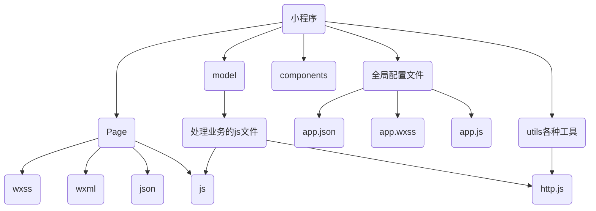

# 瀑布流的实现（下）：良好的小程序结构和抽象节点的应用

_本章本来是想给大家直接讲解瀑布流最后一点内容的，但是为了让大家更容易理解瀑布流实现中的细节还是给大家普及一下良好的小程序的结构_

> ## 良好的小程序结构
首先在讲解之前，大家试想一个问题：

**为什么要有良好的小程序结构？**

这里讲的结构其实不仅仅只是大家所说的一个小程序包含page和全局文件，page下有四个文件。其实对于结构，我个人的理解更倾向于它是一种框架。

我之前有看过别人写的小程序项目源码，大部分给我的直观感受是‘难懂’(当然这可能和我自身的修为有关)，难懂主要体现在page下的js代码中，我看到他每个page下的js文件大概400来行吧，如果是随便写着玩的是没什么问题的，但是当业务越来越复杂，项目的可维护性是很差的，而且可读性也很差。这也是我推荐大家使用良好的小程序结构的原因。

### 良好的小程序结构是怎样的？

我认为比较良好的小程序结构是这样的


首先处理业务应该在业务层（model），处理完的业务只需将数据返回给page下的js文件即可，page下的js文件主要负责数据绑定和页面的初始化。

其次是http请求的发送不应该在page下的js文件中，而应该专门用一个js文件来发送http请求。

最后整个调用过程就是，通过http.js文件获得数据，model层调用数据并将数据进行处理，然后将处理的数据传给page下的js文件，page下的js文件对数据进行数据绑定。model其实充当的是一个中转站的角色。其实有接触过后端的小伙伴可能会比较了解，这很像后端的springMVC

### 良好的小程序结构的优点

为什么说前面的小程序结构就是良好的？上面的结构的优点体现在哪呢？

对于前面的结构好在哪里，我总结了几点：

+ 权责分明：每个层之间的分工是很明确的

+ 可读性强：这样做避免了将所有业务都写在page下的js文件中而导致文件的可读性差的问题

+ 维护性强：无论是对以后增加业务还是修改业务，这种方案的维护成本无疑是比较低的


>## 抽象节点的使用
_这里我们要引用组件使用抽象节点来实现瀑布流，当然也可以自己实现，我只是觉得用这种方法比较简单而已_

### 什么是抽象节点？

微信公众平台的定义是这样的：有时，自定义组件模板中的一些节点，其对应的自定义组件不是由自定义组件本身确定的，而是自定义组件的调用者确定的。这时可以把这个节点声明为“抽象节点”

用比较直白的话来说就是这里有一个自定义组件，至于这个自定义组件应该是怎样的是调用者决定的。举个栗子：就像你买了一套三房一厅的房子。房子的类型（三房一厅）已经确定好了，至于你想要装修成什么风格在于你自己。

### 抽象节点的使用
抽象节点的使用比较简单，这里通过一段代码来解释
```javascript
<selectable-group generic:selectable="custom-checkbox" />
```
selectable-group：其实就是你要引用的组件，基本的大框架已经搭好了。
generic：是你要指定你自己定义的组件的组件名
selectable：就是你的自定义组件名
custom-checkbox：是具体哪个组件实例
### 用组件实现瀑布流

_前面讲了一大堆，都不是瀑布流的具体实现，接下来进入正题_
#### 在wxml中引用瀑布流的组件。
组件地址：[lin-ui](https://github.com/TaleLin/lin-ui)
```javascript
<view class="spu-bottom">
      <l-water-flow generic:l-water-flow-item="s-spu-preview"></l-water-flow>
</view>
```
#### 在model层调用数据
实例化Paging对象，将其返回，由于之前我们在Paging类中获得了数据并对其做了相关处理，忘了的话可以看我的第一篇博客[瀑布流的实现（上）](http://blog.namunana.cn/posts/flow_url.html)，这里只需要实例化即可。
```javascript
import {Http} from "../utils/http"
import { Paging } from "../utils/paging"

class SpuPaging{
  static getLatestPaging(){
    return new Paging({
      url:`spu/latest`
    },3)
  }
}
export{
  SpuPaging
}
```
#### 在page下的js文件中调用
```javascript
async onLoad(options) {
    this.initBottomSpuList()
  },

  async initBottomSpuList(){
    const paging = SpuPaging.getLatestPaging()
    this.data.spuPaging=paging
    const data = await paging.getMoreData()
    if(!data){
      return
    }
    wx.lin.renderWaterFlow(data.items)
  }
```
上面代码的第12行是将数据传给抽象组件中的自定义组件，这里是传给s-spu-preview。这里要传一个数组进去，而在s-spu-preview的js中只需定义一个变量接收即可（如下），这里的data和上面第8行的data是不同的两个data。
```javascript
properties: {
    data:Object
  }
```
#### 抽象组件中的自定义组件
这个自定义组件由于是调用者自行决定的，每个人的需求不一样，这个就因人而异了，这里不做过多的介绍了。

#### Http类内部的封装
这是第一篇博客[瀑布流的实现（上）](http://blog.namunana.cn/posts/flow_url.html)挖下的坑，有关于async和await的详细讲解在第二篇博客[异步函数的取值](http://blog.namunana.cn/posts/async_url.html)，这里就不作过多的介绍。
```javascript
import {config} from "../config/config";
import {promisic} from "./util";
class Http {
  static async request({url, data, method = "GET"}) {
   const res = await promisic(wx.request)({
      url: `${config.apiBaseUrl}${url}`,
      data,
      header: {
        appkey: config.appkey
      },
      method: 'GET'
    })
    return res.data
  }
}
export{
  Http
}
```

_整个实现过程就完成了，其实这里的难点主要体现在两个地方：一是抽象节点的理解及其应用，二是对分页数据的处理。这两个难点其实也就是我这两篇博客的主题，重要的在于实现的思想。希望对你们有帮助_